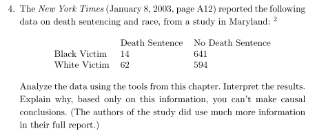

```{r, echo=FALSE}

```

```{r, echo=FALSE}
message('H0: Death Sentence and Victims Colour are indeperdent' )
message('H1: Death Sentence and Victims Colour are deperdent. Null hypothesis is rejected')
```
```{r, echo=FALSE}
message('To test the hyposesis we need to calculate p-value, which is a measure of the evidence 
against H0. The smaller the p-value, the stronger the evidence against H0. ')
```

```{r, echo=FALSE}
message('Pearsons X2 test statistic for independence is ')
```

```{r,echo=FALSE}
x  = c(14,62,641,594)
x  = matrix(x,2,2)
n  = sum(x)
mr = apply(x,1,sum)
mc = apply(x,2,sum)
message('Death Sentencing and Race:')
print(x)
```
```{r, echo=FALSE}
### expected counts
E  = matrix(c(mr[1]*mc[1],mr[2]*mc[1],mr[1]*mc[2],mr[2]*mc[2]),2,2)/n
message('Expected counts')
print(E)
```

```{r, echo=FALSE}
### chi^2 test
U <- sum((x-E)^2/E)
p <- round(1-pchisq(U,1),9)
message('U statistic: ', U)

message('p-value ', p)
```
```{r,echo=FALSE}
prob <- 0.95
# interpret p-value
alpha = 1.0 - prob
message('significance= ', alpha, ' p_value= ', p)

if(p <= alpha)
{
    print("Dependent: Null hypothesis is rejected")  # Statement
}else{
    print("Independent (fail to reject H0")
}


```

